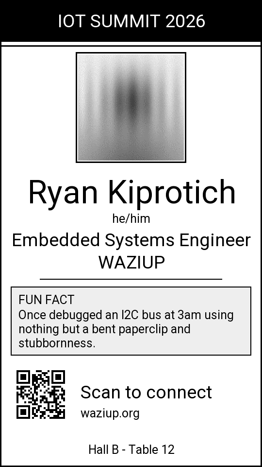
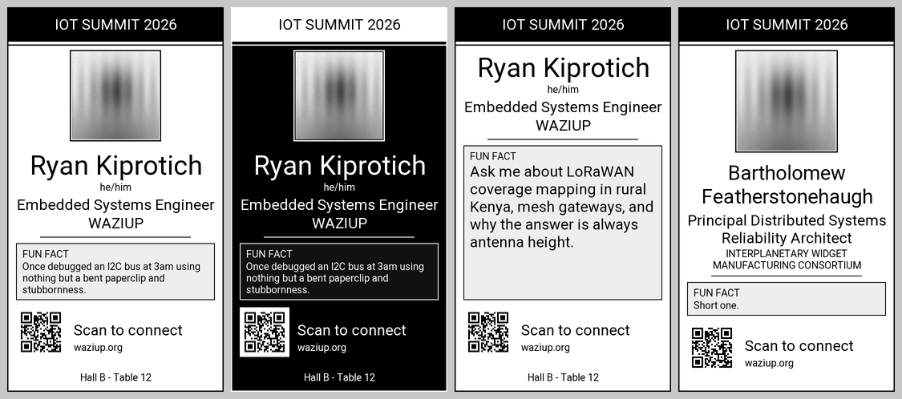
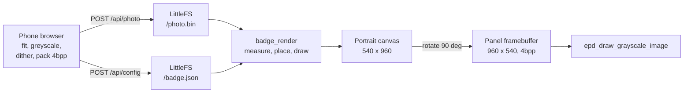

# E-Paper Conference Badge

A wearable, rewritable conference badge for the **LilyGo T5 4.7" ESP32-S3**
e-paper board (and the pin-compatible DFRobot 4.7" module).

It shows a portrait badge -- photo, name, pronouns, job title, company, a fun
fact and a QR code -- and hosts a phone-friendly setup page so you can change
any of it from the show floor without a laptop, a cable or a rebuild.

The image stays on screen while the board sleeps, because e-ink needs no power
to hold a picture.



<sub>Rendered by `tools/preview.py`, which runs the firmware's own layout code
against the real font data. See [Previewing without hardware](#previewing-without-hardware).</sub>

---

## Contents

- [Features](#features)
- [Gallery](#gallery)
- [Hardware](#hardware)
- [Quick start](#quick-start)
- [First boot](#first-boot)
- [The setup page](#the-setup-page)
- [How it works](#how-it-works)
- [Power and sleep](#power-and-sleep)
- [HTTP API](#http-api)
- [Configuration reference](#configuration-reference)
- [Project layout](#project-layout)
- [Previewing without hardware](#previewing-without-hardware)
- [Customising](#customising)
- [Troubleshooting](#troubleshooting)
- [Known limitations](#known-limitations)
- [Credits and licensing](#credits-and-licensing)

---

## Features

- **Portrait layout on a landscape panel.** The driver has no rotation support,
  so the firmware owns a 540 x 960 logical canvas and rotates every write.
- **Self-sizing layout.** Fixed blocks are placed first; the photo absorbs the
  slack. Long names wrap at a large face instead of shrinking to unreadable.
  Nothing is silently clipped.
- **Photo upload from your phone.** Frame, adjust and dither in the browser;
  the badge stores finished pixels. No JPEG decoder on the device.
- **QR code** holding a link, a vCard built from your contact details, WiFi
  credentials, or plain text. The encoder picks the smallest version that fits
  so the modules stay chunky enough to scan from a lanyard.
- **Captive portal.** Joins your WiFi if you give it credentials, falls back to
  its own access point so you cannot lock yourself out.
- **No filesystem upload step.** The whole setup page (22 kB) is compiled into
  the firmware. Flashing is the only step.
- **Sleeps between edits** and skips the refresh entirely if nothing changed.
- **16 grey levels**, dithered, with two-pass ghost clearing.
- **Dark theme**, 180 degree flip, optional border and footer line.

## Gallery



<sub>Default, dark theme, no photo, and a deliberately over-long name, title and
company.</sub>

## Hardware

|  |  |
|---|---|
| Board | LilyGo T5 4.7" **ESP32-S3** (`T5-ePaper-S3`) |
| Panel | ED047TC1, 960 x 540, 16 grey levels |
| PSRAM | 8 MB octal -- **required**, two 259 kB framebuffers live there |
| Flash | 16 MB, `default_16MB.csv`: 6.25 MB app, 3.4 MB LittleFS |
| Wake button | `BUTTON_1`, GPIO 21 |
| Battery sense | GPIO 14, divided by two (ADC2) |

Current build: **965 kB flash** (15% of the app partition), **48 kB internal
RAM** (15%), plus 506 kB of PSRAM for the two framebuffers.

The board definition is committed in `boards/T5-ePaper-S3.json` (copied verbatim
from the LilyGo repo) so nothing has to be cloned by hand.

## Quick start

You need [PlatformIO](https://platformio.org/install) -- the VS Code extension,
or `pip install platformio`. Every dependency is fetched automatically.

```bash
git clone <your-repo> && cd E-PAPER_CONFERENCE_BADGE
pio run -t upload
pio device monitor
```

Expected serial output on a cold boot:

```
[badge] booting
[badge] battery 4.11 V
[badge] content changed, refreshing the panel
[badge] portal at http://192.168.4.1/  (also http://badge.local/)
[badge] will sleep after 10 idle minutes
```

## First boot

1. The badge draws itself with placeholder details.
2. It starts an access point called **`Badge-XXXX`** (the last two bytes of its
   MAC), password **`badge1234`**.
3. Join it from your phone. The captive portal should open on its own; if not,
   browse to <http://192.168.4.1/>.
4. Fill in your details, add a photo, tap **Save & redraw**.

Give it your home or venue WiFi under *Network* and it will join that instead,
reachable at <http://badge.local/>. If the join fails it falls back to its own
access point after about 12 seconds.

## The setup page

| Tab | What is on it |
|---|---|
| **Details** | Name, pronouns, title, company, event name for the top band, fun fact, optional footer line, and what the QR should contain |
| **Photo** | Pick or shoot an image, frame it with zoom/pan, adjust brightness and contrast, choose a dithering mode |
| **Look** | Show photo, border frame, dark theme, 180 degree flip |
| **Network** | Station credentials, and the badge's own access point name and password |
| **Status** | Battery, free memory, uptime; buttons to redraw or blank the screen |

The photo preview is exactly what the panel will show, pixel for pixel -- your
phone produces the final pixels, so there is nothing left to approximate.

---

## How it works



### Portrait on a landscape panel

The `esp32s3` branch of the LilyGo driver has no rotation support -- there is no
`epd_set_rotation()`, and `EPD_WIDTH`/`EPD_HEIGHT` are fixed at 960 x 540. So
`canvas.cpp` defines a portrait canvas as `CANVAS_W = EPD_HEIGHT`,
`CANVAS_H = EPD_WIDTH` and maps every pixel on the way out:

```c
normal : (x, y) -> (CANVAS_H - 1 - y, x)
flipped: (x, y) -> (y, CANVAS_W - 1 - x)
```

Those two are exactly 180 degrees apart, which is why the *Flip* toggle can
always fix an upside-down badge regardless of which way your lanyard hangs.

### Text

This is the awkward part. `write_string()` only lays glyphs out horizontally
into a 960-wide buffer, so it cannot draw rotated text. Each line is therefore
rendered into a **scratch framebuffer** and rotate-blitted onto the canvas, with
pure white treated as transparent so a label can sit on a filled band or a rule
without punching a hole in it. Inverted text is the same blit with `255 - v`,
which keeps the anti-aliased edges intact.

Only the strip actually used is cleared between lines -- wiping all 259 kB of
PSRAM per label would dominate the render.

### The photo pipeline

The badge never sees a JPEG. Your phone does the work in a `<canvas>`:
cover-fit and crop, greyscale, brightness/contrast, Floyd-Steinberg dithering
down to 16 levels, then packs two pixels per byte and posts the raw bitmap. The
badge streams those bytes straight to flash.

That is how a 12 megapixel camera shot reaches a microcontroller with no JPEG
decoder and no scaler, and why the preview is exact.

The wire format is trivial if you want to script it:

```
"EPB1" | uint16 width LE | uint16 height LE | rows
```

Each row is `ceil(width/2)` bytes. The **low** nibble holds the even-x pixel,
`0` = black, `15` = white -- the same packing `epd_draw_pixel()` uses
internally. A 320 x 320 photo is 51,208 bytes.

**The target size is not fixed.** Because the layout is adaptive, the badge
reports the exact square the photo will occupy in `/api/status`, and the page
produces pixels at that size. Rescaling a dithered image turns its dither
pattern into noise, so this matters: save your text details first, then do the
photo, and it lands 1:1.

### The layout algorithm

Blocks are placed from the outside in, and the photo absorbs whatever is left:

1. The **event band** (86 px) and the **QR block** (150 px) are fixed. A footer
   line, if set, takes its 29 px off the bottom first.
2. The **identity block** (name, pronouns, title, company, rule) is *measured*
   with a dry run of the same drawing code, so the measurement can never drift
   from what is actually drawn. Each heading takes the largest face that fits on
   one line; if nothing fits it wraps at the largest face that fits in **two**,
   rather than shrinking to something unreadable.
3. The **fun fact** reserves what it genuinely needs, up to three lines.
4. The **photo** gets the remainder, clamped to 180-340 px. If a long name and a
   long fun fact leave no room, the photo is dropped rather than the text.

So a terse badge gets a big portrait and a wordy one gets a smaller portrait
with everything still legible.

### Skipping refreshes

A refresh takes seconds and costs an ink cycle, so the firmware avoids doing it
needlessly. A fingerprint of the config plus the photo's size is kept in **RTC
memory**, which survives deep sleep. On wake the badge compares it against what
it last drew and, if nothing moved, goes straight to serving the portal.

### Text encoding

Only the mid-size `Roboto` face carries Latin-1; `Roboto12/18/32` are ASCII
only, and the renderer silently skips glyphs it does not have -- which would
have quietly turned *José Muñoz* into *Jos Muoz*. Every string is therefore
folded to ASCII first (accents stripped, smart quotes and dashes normalised)
using tables in `src/ascii_fold.h` generated from the Unicode database.

## Power and sleep

| `Sleep after` | Behaviour |
|---|---|
| `10` (default) | Portal stays up for 10 idle minutes, then deep sleep |
| `0` | WiFi stays on indefinitely -- fine on a desk, hungry on battery |
| `1`-`240` | Anything in between |

The panel keeps its image through deep sleep with the power completely off.

**Button (GPIO 21):** short press redraws; hold for 1.5 s to sleep immediately.
The press that wakes the badge is ignored until you let go, so a slow release
cannot put it straight back to sleep.

Battery voltage is sampled once at boot, **before WiFi starts**, because GPIO 14
is on ADC2 which the radio takes over. On USB power it simply reads high.

## HTTP API

| Method | Path | Notes |
|---|---|---|
| `GET` | `/` | The setup page |
| `GET` | `/api/config` | Settings as JSON; passwords masked as `__unchanged__` |
| `POST` | `/api/config[?render=1]` | JSON body. **Send the whole object** -- missing keys reset to defaults |
| `GET` | `/api/status` | Mode, IP, RSSI, battery, heap, PSRAM, uptime, live photo box size |
| `POST` | `/api/render` | Redraw with two ghost-clearing passes |
| `POST` | `/api/blank` | Wipe to white |
| `GET` | `/api/photo` | The stored `EPB1` bitmap |
| `POST` | `/api/photo[?render=1]` | Multipart upload, field name `photo` |
| `DELETE` | `/api/photo` | Remove the stored photo |

Send `__unchanged__` back in a password field to leave it alone.

Refreshes are **queued and run after the response has been flushed**, so no
request ever blocks for the seconds a panel update takes. Uploads are streamed
straight to a temp file and only promoted over `/photo.bin` once the `EPB1`
header and length check pass.

```bash
# read the current settings
curl http://badge.local/api/config

# change one thing (fetch, edit, post the whole object back)
curl -X POST 'http://badge.local/api/config?render=1' \
     -H 'Content-Type: application/json' \
     -d '{"name":"Ryan Kiprotich","company":"Waziup", ... }'

# upload a photo you packed yourself
curl -X POST 'http://badge.local/api/photo?render=1' -F photo=@photo.bin
```

## Configuration reference

Stored as `/badge.json` on LittleFS. Written to a temp file and renamed, so a
power cut mid-save cannot leave a truncated config behind.

| Key | Type | Default | Notes |
|---|---|---|---|
| `name` | string | `Your Name` | Wraps to two lines if long |
| `pronouns` | string | `""` | Small line under the name |
| `profession` | string | `Your Job Title` | |
| `company` | string | `Your Company` | Rendered in caps |
| `funFact` | string | *(placeholder)* | ~130 chars fit at the larger size |
| `event` | string | `CONFERENCE 2026` | Top band, rendered in caps |
| `footer` | string | `""` | Optional line at the very bottom |
| `qrMode` | enum | `url` | `url` / `text` / `vcard` / `wifi` |
| `qrText` | string | `https://example.com` | Payload; for `wifi` use `SSID\|password` |
| `qrCaption` | string | `Scan to connect` | Beside the QR |
| `email` | string | `""` | In the vCard; caption line if no website |
| `phone` | string | `""` | In the vCard |
| `website` | string | `""` | Printed under the caption |
| `showPhoto` | bool | `true` | Off gives the text more room |
| `flip` | bool | `false` | Rotate the layout 180 degrees |
| `invert` | bool | `false` | Dark theme |
| `border` | bool | `true` | Hairline frame around the badge |
| `sleepAfterMin` | int | `10` | `0` = never sleep; capped at 240 |
| `apSsid` | string | `""` | Empty means `Badge-XXXX` from the MAC |
| `apPass` | string | `badge1234` | Under 8 chars is treated as an open network |
| `staSsid` | string | `""` | Leave empty to stay in AP mode |
| `staPass` | string | `""` | |

`qrMode` values build the payload differently: `vcard` assembles a VCARD 3.0
from your name, title, company, email, phone and website; `wifi` emits a
`WIFI:T:WPA;S:...;P:...;;` string that phones offer to join on scan; `url` and
`text` pass `qrText` through untouched.

## Project layout

| File | |
|---|---|
| `src/main.cpp` | Boot, battery, button, deep sleep |
| `src/canvas.{h,cpp}` | Portrait canvas over the landscape panel: pixels, rects, text, QR, photo, ASCII folding |
| `src/badge_render.{h,cpp}` | The badge layout and its measure/draw passes |
| `src/badge_config.{h,cpp}` | Settings, LittleFS persistence, QR payload building, fingerprinting |
| `src/portal.{h,cpp}` | WiFi, captive portal, DNS, HTTP API |
| `src/web_ui.h` | The setup page, embedded in flash as a raw string |
| `src/ascii_fold.h` | Generated Unicode-to-ASCII tables |
| `boards/T5-ePaper-S3.json` | Board definition, copied from the LilyGo repo |
| `tools/preview.py` | Host-side layout preview |
| `tools/gallery.py` | Regenerates the README images |

## Previewing without hardware

`tools/preview.py` re-implements the glyph renderer, the portrait canvas and the
layout in Python, reading the **real compressed font data** out of the library
headers -- so text metrics are exact, not estimated. It renders the badge to a
PNG so you can check a layout change before flashing.

```bash
pip install pillow numpy qrcode
pio run                                   # once, so the fonts land in .pio/
python tools/preview.py --out tools/preview [--dark] [--no-photo] [--flip]
python tools/gallery.py                   # regenerate the README images
```

It writes `_badge.png` (what a person sees) and `_panel.png` (the raw
framebuffer), and prints the block sizes and font choices it made:

```
 - photo 218px, identity 233px, slack 386px, QR top y=749
 - Ryan Kiprotich: Roboto32 x1
 - Embedded Systems E: Roboto18 x1
 - fun fact 142px box, Roboto12, 3 line(s)
```

It caught two real layout bugs during development -- a fun fact that was being
silently dropped, and headings that shrank instead of wrapping -- so **keep it
in step with `badge_render.cpp`** if you move things around. It is a
reimplementation, not the firmware itself.

## Customising

**Layout** -- the constants at the top of `src/badge_render.cpp`:

```c
#define M          22    // outer margin
#define HDR_H      86    // event band height
#define QR_BOX    150    // target QR side, quantised down to whole modules
#define PHOTO_GAP  26    // breathing room under the photo
#define FACT_GAP   18    // breathing room above the QR block
#define FACT_PAD   12    // inside the fun fact box
#define FACT_LINES  3    // most lines reserved for the fun fact up front
#define PHOTO_MIN 180
#define PHOTO_MAX 340
```

Change them, run `python tools/preview.py`, look at the PNG, repeat.

**Fonts** -- `Roboto12` / `Roboto18` / `Roboto` / `Roboto32` ship with the
driver library. To add a size or a face with wider Unicode coverage you need the
EPD47 font converter from the LilyGo repo; drop the generated header in `src/`,
include it from `badge_render.cpp` only (these are `const` at file scope, so
including them twice just duplicates the data), and add it to the font ladders.

**Adding a field** -- touch four places: the struct in `badge_config.h`,
`applyJson`/`fillDoc` in `badge_config.cpp`, the form in `web_ui.h` (add the id
to `TEXT_KEYS`), and the layout in `badge_render.cpp`. Add it to
`configFingerprint()` too, or changing it will not trigger a redraw.

**Photo size or format** -- `canvasDrawPhoto()` in `src/canvas.cpp` and
`packEPB1()` in `src/web_ui.h`.

## Troubleshooting

**The badge is upside down.** Tick *Flip 180°* under Look.

**`FATAL: no PSRAM for the framebuffers`.** The build is not configured for
octal PSRAM. Check that `board = T5-ePaper-S3` is being picked up from
`boards/` -- `[platformio] boards_dir = boards` in `platformio.ini` is what
makes that work.

**Battery always reads 0 V.** It is sampled once at boot before WiFi starts,
because GPIO 14 is on ADC2. If you need live readings you would have to stop the
radio first.

**Ghosting.** Every content refresh already runs two clear cycles. If a stubborn
shadow remains, hit *Clear screen to white* on the Status tab a couple of times.
Leaving the panel white before storing it for months is kind to it.

**The QR will not scan.** Shorten the payload. The encoder picks the smallest
version that fits, so a short link gives chunky modules while a full vCard gives
small ones. `https://` links scan well at this size; long vCards are marginal.
The serial log prints a warning if the payload will not fit at all.

**A character vanished or became `?`.** Anything outside Latin-1 and Latin
Extended-A folds to `?`. See [Text encoding](#text-encoding).

**The page loads but saving fails.** Check free space on LittleFS via the Status
tab; a failed photo upload leaves nothing behind, but a full filesystem will
reject `badge.json` writes.

**The badge went to sleep while I was typing.** Only requests count as activity.
The page polls `/api/status` every 20 seconds, which keeps the timer at bay
while the tab is open -- but a backgrounded phone browser may be throttled. Set
`sleepAfterMin` to `0` while you are setting things up.

## Known limitations

- **Latin script only.** See [Text encoding](#text-encoding).
- **Partial refresh is not used.** Every update is a full-panel refresh, which
  is slower but avoids accumulating ghosts on a badge that changes rarely.
- **One client at a time.** The synchronous `WebServer` is deliberate -- it is
  stable and dependency-free, and a badge has one user.
- **The AP password is stored in plain text** in `badge.json`, like any Arduino
  WiFi sketch. Anyone who can read the flash can read it.
- **`POST /api/config` is not a patch.** Missing keys reset to defaults; fetch,
  edit, and post the whole object.
- **`tools/preview.py` is a reimplementation**, not the firmware. It can drift.

## Credits and licensing

| Component | License |
|---|---|
| [LilyGo-EPD47](https://github.com/Xinyuan-LilyGO/LilyGo-EPD47) (`esp32s3` branch) | **GPL-3.0** |
| [QRCode](https://github.com/ricmoo/QRCode) by Richard Moore | MIT |
| [ArduinoJson](https://arduinojson.org/) by Benoit Blanchon | MIT |
| Roboto typeface | Apache-2.0 |

**Note the driver's licence.** This firmware links against LilyGo-EPD47, which
is GPL-3.0. If you distribute binaries or a fork, the combined work is
effectively GPL-3.0 and you need to offer the corresponding source. Keeping it
to yourself imposes no obligation. If you need a permissive licence, the driver
is the piece that would have to be replaced -- the badge code itself has no
other copyleft dependency.

Pick a licence for your own code and drop it in `LICENSE`; GPL-3.0 is the
path of least resistance given the above.
